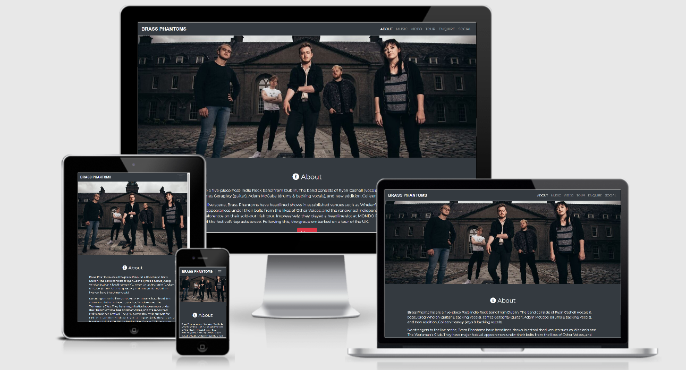

<h1 align="center">Brass Phantoms Website</h1>

[View the live project here.](https://jesson96.github.io/BrassPhantoms/#social).

This is the main website for the band Brass Phantoms. They are an up and coming band in the Irish and UK market who will use this website to increase traction for the band and their new album. The website is designed to be responsive and accessible on a range of devices, making it easy to navigate and discover information about the bands new music, events and social platforms.

## User Experience (UX)

#### Project Goals

This website was designed for the band members, so they can build or improve their online presence on a range of social platforms. The ultimate aim of the website is to increase traffic for their newly released album and increase recognition of the bands body of work. 
Potential viewers will be greeted by a hero image of the band, a short about section with an option to read more via a modal and then embedded content containing the bands music, mainly viewed on Spotify. Soft targets include enquiries about the band's availability largely due to the fact that performing live events is not an option right now due to Covid19 restrictions.
Viewers of the website can easily access the bands social platforms by clicking on the icons in the footer or by opening their music via embedded content.

  ### User Stories

#### First Time Visitor Goals

1. As a first time visitor, I want to easily understand the main purpose of the site and learn more about the band and the band members.
2. As a first time visitor, I want to be able to easily navigate throughout the site to find content that I am looking for.
3. As a first time visitor, I want to look for information about the bands music and locate the type of platforms that the band advertises their music on.

#### Returning Visitor Goals

1. As a returning visitor, I want to find information about the bands social media links so I can stay updated with their most current music and news.
2. As a returning visitor, I want to view the bands tour and upcoming events so I can purchase a ticket to one of their shows.
3. As a returning visitor, I want to be able to view the bands most current music and videos.

#### Frequent User Goals

1. As a frequent visitor, I want to sign-up to the bands newsletter so I can stay updated with the bands most current news.
2. As a frequent visitor, I want to check to see if there are any newly added music/music videos.
3. As a frequent visitor, I want to check the tour section of the site to see if any new shows have been scheduled. 

### Design

#### Colour Scheme
* The two main colours used are dark grey, and white because it reflects the bands image as an indie rock band as well as images used every second section to let users know they are in a new section.

#### Typography
* The two main fonts chosen for the website were Libre Franklin and Montserrat.

#### Imagery
The imagery on the site is important. The site will include  a main hero image which is designed to catch the user's attention and provide clarity to viewers, particularly,  the image of the band and who they are superficially. Another image of the band is displayed as the cover of the tour section. Unfortunately good quality images of the band were not plentiful so a gallery or carousel was not included.

### Wireframes

* Desktop Page Wireframe - [View](wireframes/desktop-wireframe.pdf)

* Mobile Wireframe - [View](wireframes/mobile-wireframe.pdf)

### Features 
* The hero image in the header allows users to know the image of the band and who they are.
* The about page gives a summary of the band with a modal included where viewers can click and read more information about the band if they wish.
* The music section includes a background image of a live concert with the bands music embedded. This section allows the band to showcase their album as well as three popular singles they have released. 
* The video section allows users to view the bands music videos on the site via YouTube.
* The tour section informs the user of when new events or shows are scheduled. Unfortunately they have no shows booked due to Covid19 so I added some fictitous shows via Livestream on Youtube and a red banner to let the user know no live shows will be happening until restrictions are lifted.
* An enquire modal will also be included for potential customers to book the band for live events in the future.
* The footer will include a newsletter and social icons to keep users updated on new information and increase the bands following.
* The website is responsive on all device sizes.

### Features to be implemented
* The enquire modal should submit enquiries to the bands gmail account.
* The newsletter should submit the users informations and respond with a confirmation email that they have been added to a subscriber list.
* A gallery should be included when further images of the band have been taken.

##  Technologies used

- [HTML5](https://en.wikipedia.org/wiki/HTML5/) - provides the content and structure for my website.
- [CSS3](https://en.wikipedia.org/wiki/CSS/) - provides the styling.
- [Bootstrap](https://www.getbootstrap.com/) - used to create the layout of the project.
- [Balsamiq](https://www.balsamiq.com/) - used to create the project's wireframes.
- [Gitpod](https://www.gitpod.io/) - used to develop the website.
- [GitHub](https://www.github.com/) - used to host the project.
- [Google Fonts](https://www.fonts.google.com/) - used to provide the fonts for the website.
- [Font Awesome](https://www.fontawesome.com/) - used the font awesome icons to style the information and the links in the footer, and also to make the Reservation section stand out a small bit.
- [Pixabay](https://www.pixabay.com/) and [Freepik](https://www.freepik.es/) - used to get one image each for the project.
- [TinyJPG](https://www.tinyjpg.com/) - used to compress the size of the images.
- [W3schools] (https://www.w3schools.com/) - used to validate certain processes.
- [breakingtunes] (https://www.breakingtunes.com/bpdublin) - used and edited to help write the about page for the band.
- [Stackoverflow] (https://stackoverflow.com/) - used to help navbar close on small devices when clicked.
- [AmIResponsive] (http://ami.responsivedesign.is/) - used for hero-image in README.md.
- [CSStricks] (https://css-tricks.com/fluid-width-video/) - used to help makes videos 100% of container.

## Testing

The testing process can be seen [here](TESTING.md).

## Deployment

### To deploy the project

This project is hosted on GitHub Pages

1. In the menu on the top of the project’s repository in GitHub select Settings.
2. Scroll down to the GitHub Pages section.
3. Inside that section, click on the drop-down menu under Source and select Master Branch.
4. The page will now refresh automatically and the website is now deployed.
5. The link to the webpage is just in the GitHub Pages section down below.

Only one branch has been used for this project.

### To run the project locally

To clone this project from GitHub:

1. Under the repository’s name, click Clone or download.
2. In the Clone with HTTPS section, copy the URL.
3. In the IDE of choice, open Git Bash.
4. Change the current working directory to the location where you want the cloned directory to be made.
5. Type git clone, and then paste the URL copied from GitHub.
6. Press enter and the local clone will be created.

## Credits

### Content
Some of the text I got from the about me page is from breaking tunes and edited by me to suit the site. 

###  Media

The pictures used in this site were obtained from [Pixabay](https://pixabay.com/) and [Freepik](https://www.freepik.es/) as recommended by my mentor. Other images of the band were obtained by one of the band member Greg who sent me them via Google drive.
Embedded content is from Spotify and Youtube. 

###  Acknowledgments

[Precious Ijege](https://www.linkedin.com/in/precious-ijege-908a00168/?originalSubdomain=ng) for the mentor guidance and support.
