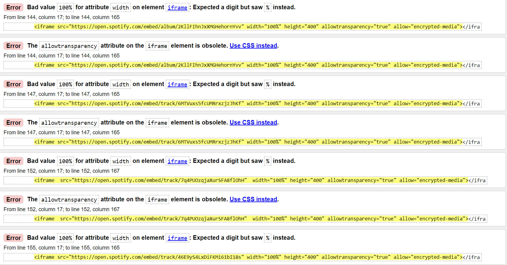
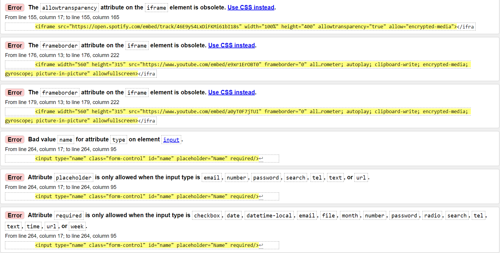
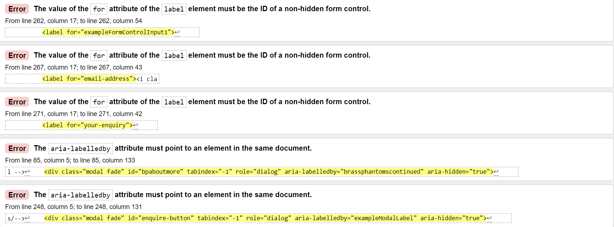
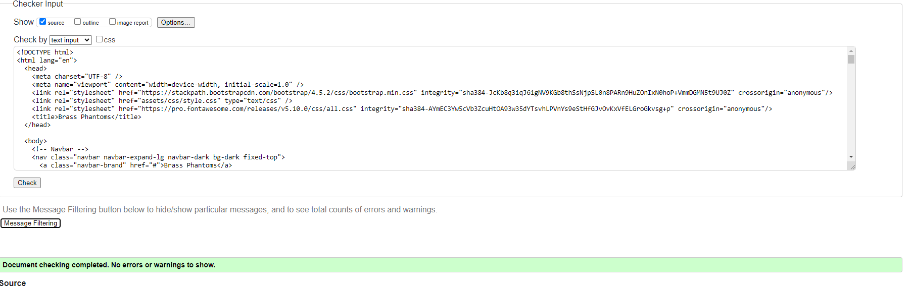
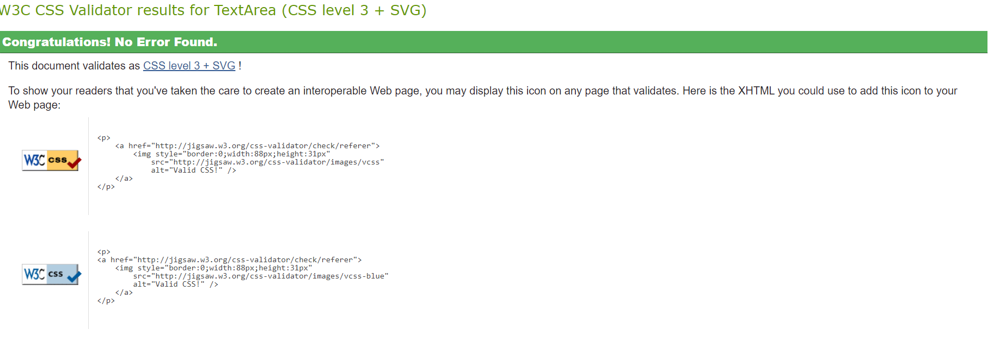

# Testing

## Code validators

* [HTML Validator](https://validator.w3.org/) : HTML validator found 18 errors mostly to do with iframes.

## When I changed width from "width='100%'" to style="width: 100%;" on all iframes and deleted the allow transparency attribute it fixed 8 errors. 

* Also changed input type from name to text which got rid of 1 error. Also got rid of placeholder because it wasn't applicable. Required attribute was deleted from input with an id of name. Iframe errors in this image were fixed when fixing iframe errors in previous image.

* Took note of errors and matched aria labels with respective ids and now there are no more errors in the HTML validator.

* [CSS Validator](https://jigsaw.w3.org/css-validator/) : 
## CSS validator test did not find any errors.

## Testing User stories

#### First Time Visitor Goals

1. As a first time visitor, I want to easily understand the main purpose of the site and learn more about the band and the band members.
    * As a user first enters the site they will be greeted by a navigation bar, a hero-image and an about section of the band members.

2. As a first time visitor, I want to be able to easily navigate throughout the site to find content that I am looking for.
    * A navigation bar at the top of the page is clearly visible on all devices which can navigate the user to any section of the site they are looking for.

3. As a first time visitor, I want to look for information about the bands music and locate the type of platforms that the band advertises their music on.
    * The navigation bar displays a music, video and social section where a user can listen to the bands music on the site and reach the bands social platforms by clicking on the social icons in the footer.

#### Returning Visitor Goals

1. As a returning visitor, I want to find information about the bands social media links so I can stay updated with their most current music and news.
    * A user can locate social media accounts of the band in the footer along with a newsletter to stay updated about new music and events.

2. As a returning visitor, I want to view the bands tour and upcoming events so I can purchase a ticket to one of their shows.
    * The tour section is easily accessible by a user from the navigation bar.

3. As a returning visitor, I want to be able to view the bands most current music and videos.
    * The bands most current album is embedded first in the music section via Spotify which a user can select any song and play from their most current music. The bands music videos are limited with only 2 professional music videos made so far which are included on the site.

#### Frequent User Goals

1. As a frequent visitor, I want to sign-up to the bands newsletter so I can stay updated with the bands most current news.
    * The bands newsletter is located in the footer where a user can easily sign-up.

2. As a frequent visitor, I want to check to see if there are any newly added music/music videos.
    * A user can find the most up tp date music and videos in the music and video section.

3. As a frequent visitor, I want to check the tour section of the site to see if any new shows have been scheduled. 
    * A user can check this by using the navbar to go to the tour section or by scrolling down.

## Responsiveness

* To test the responsiveness of the site I used [Chrome DevTools](https://developers.google.com/web/tools/chrome-devtools) on a number of devices. 

## Browser Compatibility

* [PowerMapper](https://try.powermapper.com/demo/Report/679c61f5-609e-4ae8-b8be-56050f6afbf2) * Powermapper stated that it is compatiable on all devices.

!(readme-files/compatibilitycheck.png)

## Bugs 
* The design is responsive in most screen sizes except for a galaxy fold where the navbar covers some headings and some of the hero-image.
